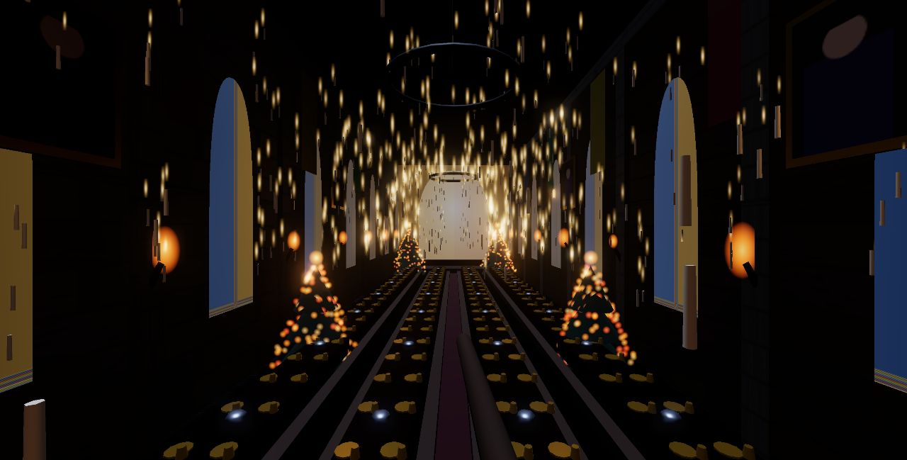
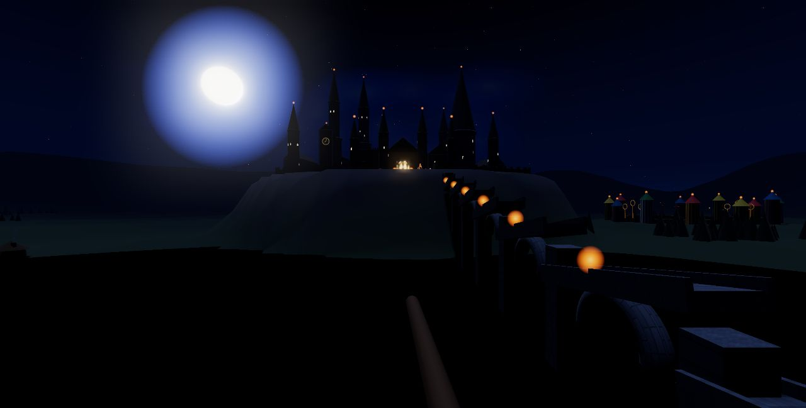
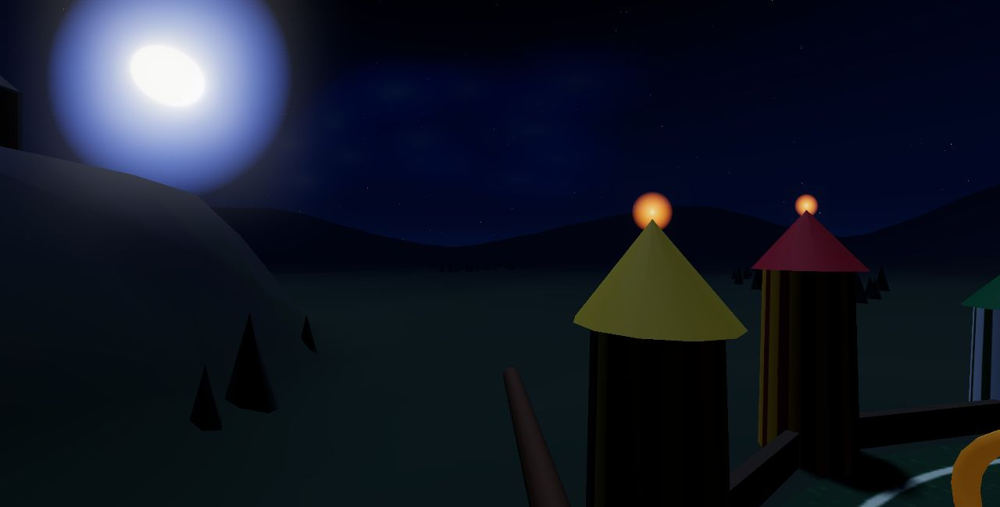

# Nightflight — a broom over Hogwarts

A first-person, free-flight Hogwarts at Christmas, in the browser. You start
hovering over the Black Lake with the castle ahead and simply fly — through the
great doors, under a thousand floating candles, past classrooms in session, and
over a Quidditch match in progress. A golden wisp leads the way; place names fade
in when you arrive.





## The world

- **Great Hall** — cathedral scale: floating candles with floor reflections, a
  starry gothic vault that mirrors the sky outside, stained-glass lancets, gilt
  portraits, iron chandeliers, tables laden with gold plates & goblets, and four
  fairy-lit Christmas trees.
- **Two classrooms** off the courtyard with classes in session — candle-lit
  desks, seated students, a hatted teacher, bookshelves.
- **Quidditch pitch** — striped house stands, three golden hoops per end, two
  teams banking laps and a darting snitch.
- Astronomy tower, clock tower, cobbled courtyard with lamp posts, Hagrid's hut
  with a smoking chimney, an arched viaduct down to the boathouse, pine forest,
  mountains, drifting lake fog.
- **Sun cycle** (~5 min): night → dawn → golden morning and back — sky, fog,
  moon, stars, window lights and the enchanted ceiling all follow.
- **Solid world**: terrain + building collision. You fly around towers and
  through doorways, never through walls.

## Run

```bash
cd nightflight
python3 -m http.server 8000
# open http://localhost:8000 → MOUNT THE BROOM
```

## Controls

| | |
|---|---|
| **Mouse** | look / steer |
| **W** / ↑ | fly · **SHIFT** boost · **S** slow |
| **A/D**, **Q/E** | turn / bank |
| **SPACE / CTRL** | rise / descend |
| **TAB** | next destination |
| **ESC** | release mouse |

## Experiment notes

The question behind this one: **how far can a single self-contained HTML file get
toward "feels like the movies" with zero downloaded assets?** Everything is
procedural — canvas-painted textures (ashlar stone, stained glass, starry
ceiling, clock face), instanced geometry (~1,000 windows, tableware, forest),
shader point-cloud candles, analytic terrain shared by the mesh and the flight
physics, WebAudio wind synthesized from noise.

What actually moved the realism needle, in order:
1. **Bloom** (UnrealBloomPass) — candlelight doesn't read as magic without it.
2. **Window treatment** — pale stone surrounds, mostly *dark* windows, only ~1 in
   4 lit. Restraint reads as real; a wall of glowing quads reads as a toy.
3. **Collision + guided navigation** — nothing breaks immersion faster than
   clipping through a wall or not knowing where to go.
4. **Life** — riders over the pitch, smoke from Hagrid's chimney, a sun that
   rises. Still worlds feel like screenshots; moving ones feel like places.

Stack: vanilla JS + Three.js r160, vendored in `lib/`. No build step, no deps.
