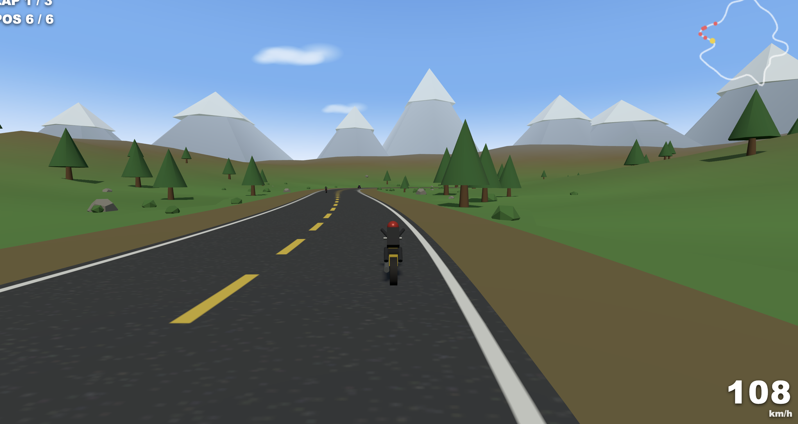

# ROAD CLASH 🏍️

A Road Rash–inspired 3D motorcycle combat racer that runs entirely in the browser —
no build step, no install, no network needed (Three.js is bundled in `lib/`).



## What's in it

- **Scenic valley landscape** — a winding ~3.5 km road through procedurally generated
  rolling hills, pine forests, bushes, rocks, a snow-capped mountain ring, drifting
  clouds, sun glow, and distance fog.
- **Road Rash combat** — 5 named rivals (Viper, Natasha, Biff, Slater, Axel). Ride up
  beside one and punch them off their bike. Watch out — they kick back.
- **Race loop** — 3 laps, live position tracking, minimap, speedometer, countdown
  start, crash/wipeout handling, win/lose screen.
- **Feel** — leaning bike, speed-based FOV stretch, chase camera, engine sound that
  pitches with your speed (WebAudio), grass that slows you down off the asphalt.

## How to play

Serve the folder with any static server (browsers block ES modules over `file://`):

```bash
# from this folder
python3 -m http.server 8000
# then visit http://localhost:8000
```

| Key | Action |
| --- | --- |
| `W` / `↑` | Throttle |
| `S` / `↓` | Brake |
| `A` `D` / `←` `→` | Steer |
| `Space` / `F` | Punch a rival beside you |
| `Enter` | Start race |
| `R` | Restart after finishing |

On touch devices, on-screen buttons appear and the throttle is automatic.

## Tech stack

- **Rendering** — [Three.js](https://threejs.org) r160 (WebGL), vendored in `lib/` and
  wired up via a native browser import map — no CDN, no bundler.
- **Language/runtime** — vanilla JavaScript ES modules, loaded straight by the browser.
  Single `index.html` file: markup, styles, and game logic together.
- **Audio** — WebAudio API for the speed-reactive engine sound, no audio files.
- **World generation** — seeded RNG (mulberry32) and value noise drive procedural
  terrain height/coloring, a Catmull-Rom spline for the track with geometry extruded
  along it, `InstancedMesh` for vegetation/rocks, and canvas-drawn textures for the
  road, clouds, and banner.
- **Tooling** — none. No build step, no package manager, no assets to fetch besides the
  vendored Three.js library. Any static file server works (see below).
